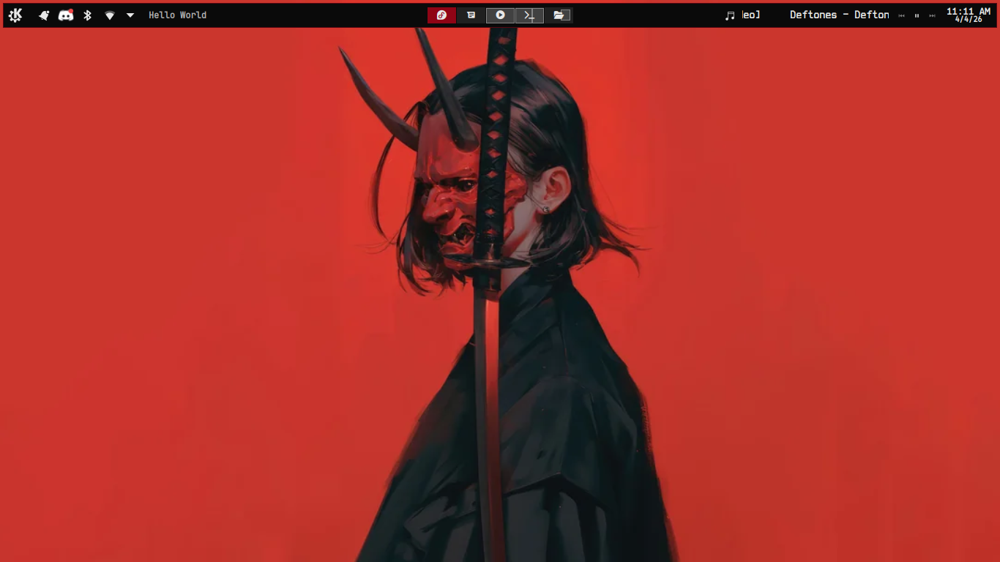
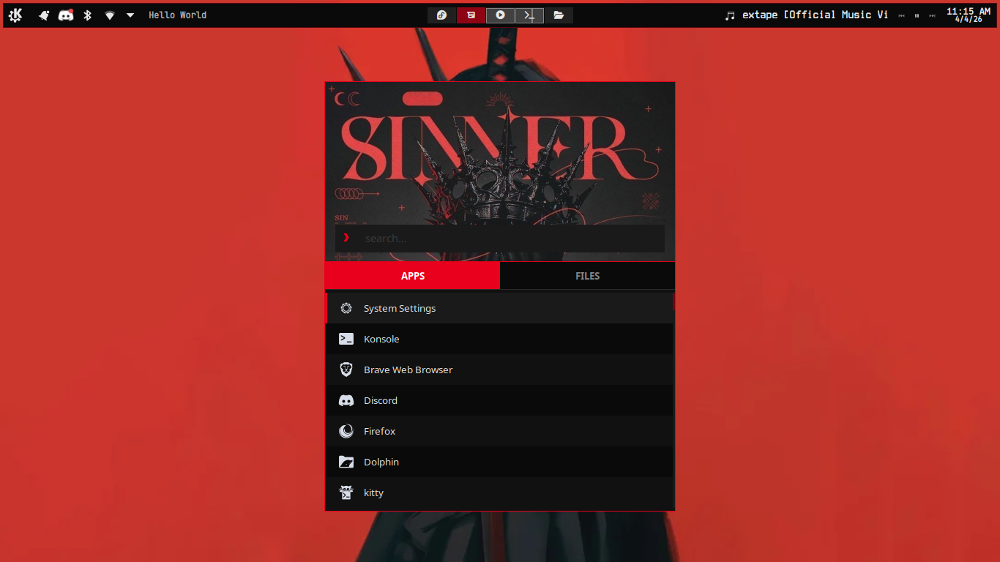
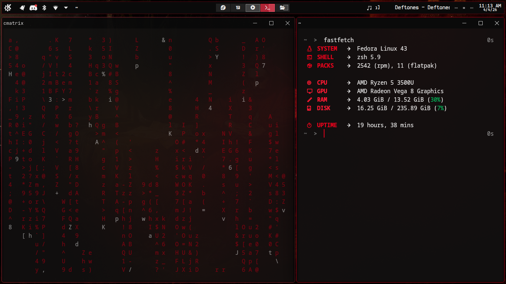
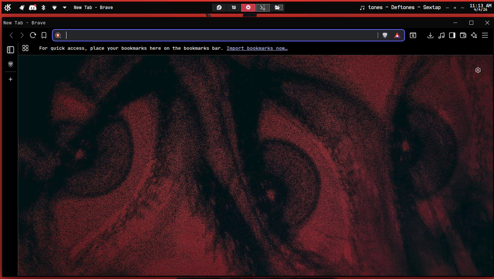

# ❤️ dotfiles ⚙️

<p align="center">
  
  
</p>
<p align="center">
  
  
</p>

> Personal dotfiles for quick setup on a fresh machine. Some configs may be edited versions of others' work credit will be added where I can track it down.

> ⚠️ **Heads up:** This is tailored to my specific setup. Just grab what you need and place the files manually — check [PACKAGES.md](PACKAGES.md) for required programs.

---

## 📁 What's here & where it goes

| File | Destination |
|------|-------------|
| `kitty/kitty.conf` | `~/.config/kitty/kitty.conf` |
| `rofi/config.rasi` | `~/.config/rofi/config.rasi` |
| `rofi/themes/e595.rasi` | `~/.config/rofi/themes/e595.rasi` |
| `fastfetch/config.jsonc` | `~/.config/fastfetch/config.jsonc` |
| `fastfetch/logo.png` | `~/.config/fastfetch/logo.png` |
| `kde/autostart/set-desktop-names.desktop` | `~/.config/autostart/set-desktop-names.desktop` |
| `kde/autostart-scripts/set-desktop-names.sh` | `~/.config/autostart-scripts/set-desktop-names.sh` |

---

## ⚙️ What's included

### Kitty
- TrackPoint red accent color scheme
- JetBrains Mono 11.5pt, semi-transparent background
- Powerline tab bar, 10k scrollback

### Rofi
- Papirus-Dark icons, drun + filebrowser modes
- Custom `e595.rasi` theme (add to `~/.config/rofi/themes/`)

### Fastfetch
- minimal, red accent keys, compact layout

### KDE
- Desktop workspace names set via autostart script on login
- See the full setup guide below ↓

---

## 🖥️ KDE workspace custom name set up

### KDE — Virtual Desktop Names & Pager Setup

The autostart script sets your workspace names using Nerd Font glyphs at login, and the Pager widget displays them on your panel.

**Prerequisites:**
- KDE Plasma 6 (`kwriteconfig6` and `qdbus`)
- A Nerd Font installed so glyphs render correctly

**Set up virtual desktops:**
1. Open **System Settings → Workspace → Virtual Desktops**
2. Add your desktops — the script covers up to 5
3. Names don't matter — the script overwrites them on login

**Add and configure the Pager widget:**
1. Right-click your panel → **Add Widgets**
2. Search for **Pager** and drag it onto the panel
3. Right-click the Pager → **Configure Pager…**
4. Set **Display** to `Desktop Name`
5. Click OK

**After copying the files, make the script executable:**
```bash
chmod +x ~/.config/autostart-scripts/set-desktop-names.sh
```

**How it works:**
- KDE tends to reset workspace names on reboot, so the script runs automatically at every login to reapply them
- `set-desktop-names.desktop` tells KDE to run the script at login (autostart phase 1)
- The script waits 2 seconds for KDE to fully load, writes the names via `kwriteconfig6`, then signals KWin to reload via `qdbus`

**Troubleshooting:**
- Glyphs show as boxes → install a Nerd Font (`ttf-jetbrains-mono-nerd` on Arch, or from [nerdfonts.com](https://www.nerdfonts.com)) and log out and back in
- Names not applying at all → run `bash ~/.config/autostart-scripts/set-desktop-names.sh` manually to test

---

## 📋 Notes

- Fonts with Nerd Font symbols are required for KDE desktop name glyphs
- The rofi config references a custom theme at `~/.config/rofi/themes/e595.rasi` — grab it from `rofi/themes/`
- you can install variety for auto changing wallpaper[https://github.com/varietywalls/variety]
- the panel colorizer was also used [https://store.kde.org/p/2130967/]
